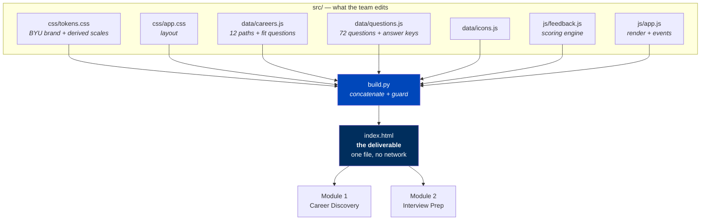
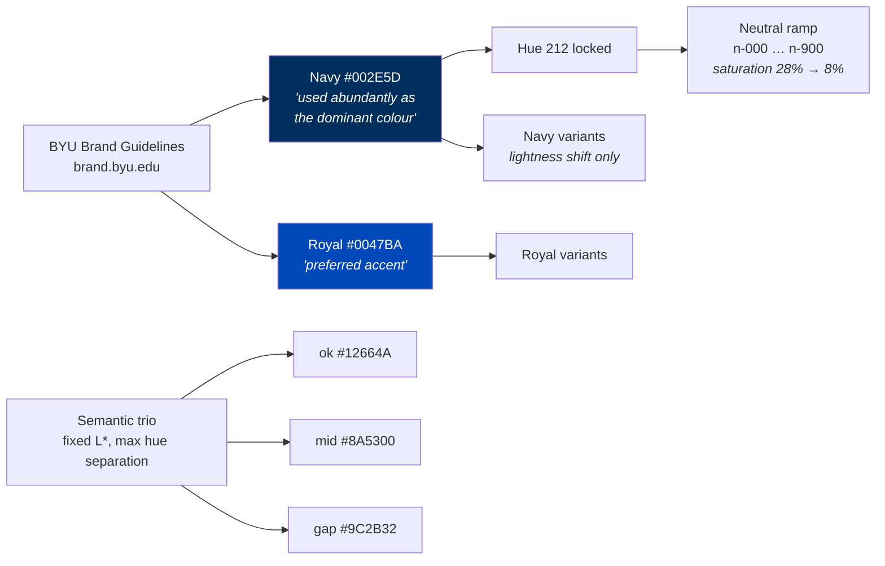
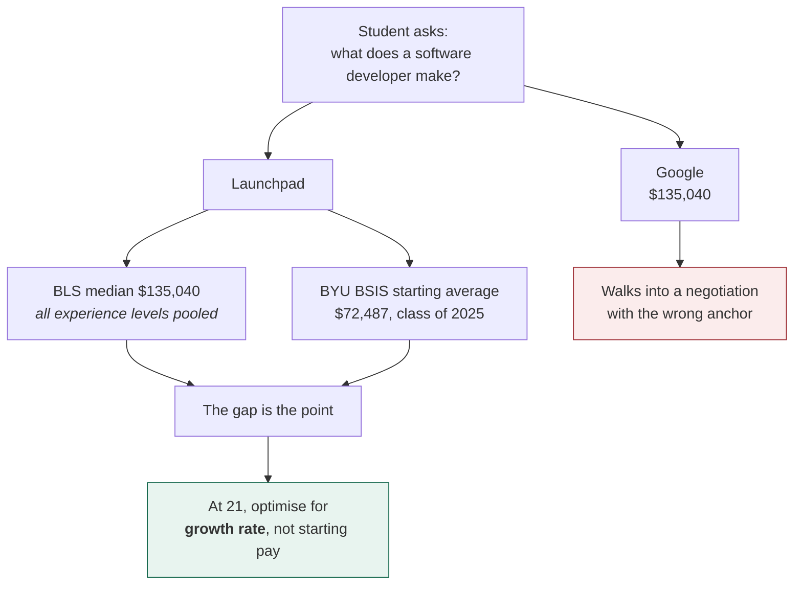
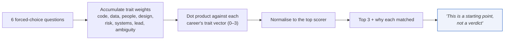
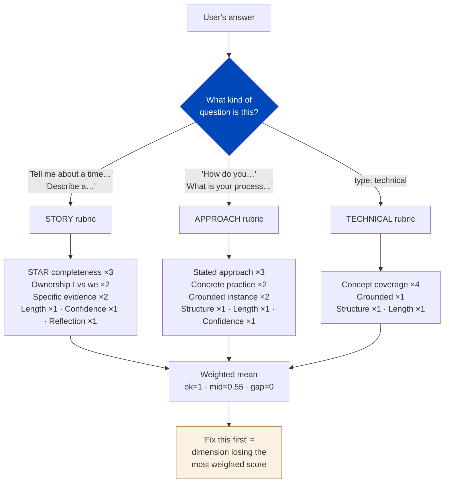
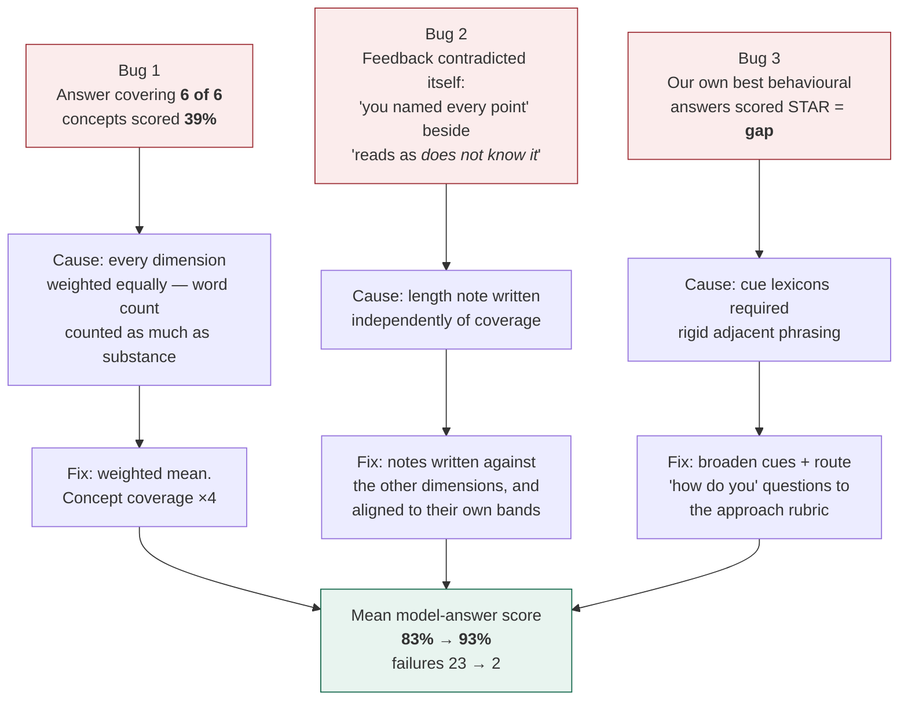

# Architecture — how this thing works

The case says: *"What matters is that you understand what you built, can explain
every component, and can speak to the decisions you made."*

This document is that explanation, organised as five principles. Each one has a
diagram, and the diagrams connect: the output of one is the input of the next.

---

## The whole system on one page



**Why a build step for a single-file deliverable?** The case requires one HTML
file. But one 4,900-line file cannot be edited by four people at once without
constant merge conflicts. So we author in `src/` — each person owns different
files — and `build.py` concatenates. The built `index.html` is committed too, so
anyone who cannot run Python still has a working copy.

`build.py` also *guards* the deliverable: it aborts if an external `<script src>`,
an external stylesheet, or an `http://` URL sneaks in, because any of those would
break the offline demo.

---

## Principle 1 — Every colour is derived, never chosen

No colour in this project was picked because it looked nice.



- Navy and Royal are the university's actual brand colours, used in the roles the
  brand guidelines specify.
- Greys are **not** a generic neutral scale. They are locked to hue 212 — Navy's
  hue — with saturation stepping down as lightness rises, so every grey on the
  page is visibly a relative of the brand colour rather than an unrelated import.
- The three feedback colours (met / partial / missing) sit at matched lightness so
  none shouts louder than the others, and each clears 4.5:1 contrast on its tint.

The consequence: the page reads as *institutional* rather than as a generic
dashboard, and every value in `tokens.css` has a one-line justification in a
comment next to it.

---

## Principle 2 — Show the number Google hides

This is the answer to *"how is your tool different from just Googling?"*, and it
drove the whole design of Module 1.



A BLS median pools a twenty-year veteran with a first-year hire. Presenting it
to a junior as "what this job pays" is actively misleading. So the pay chart
draws every occupation's national figure *and* a reference bar for what BYU
graduates actually reported as a starting salary, then names the difference in
plain language.

### Source quality is part of the data

Not all twelve roles have a BLS occupation code. Data Analyst, UX Designer, IT
Auditor, ERP Consultant, Product Manager and Cloud Engineer do not — their
figures come from salary guides (Robert Half, Glassdoor, PayScale, ZipRecruiter,
KORE1), which are self-reported or posting-derived and carry a much wider spread.

Every career record therefore carries a `payBasis` flag of `'bls'` or
`'industry'`, and the UI labels industry figures as *(industry est.)* on the
chart and prints a caveat in the detail panel. Treating a Robert Half range and a
government survey as equally authoritative would have been the easy shortcut and
the wrong one.

---

## Principle 3 — Recommend, do not decide

The Fit Finder is a scoring function, not an oracle.



Each career is hand-scored 0–3 on eight traits in `careers.js`. Each quiz option
adds weights to those same traits. The match is a dot product, normalised so the
best fit is 100%.

It is completely deterministic — the same answers always produce the same result,
and you can trace any recommendation back to the numbers. The UI states outright
that the quiz knows only what you said you *enjoy*, not what you are good at, and
that the top three are "the three worth reading about first" rather than a
verdict. A tool that overstates its own confidence teaches a student to distrust
the whole thing once they notice.

---

## Principle 4 — Useful feedback without an AI call

This was the hardest problem in the build, and it is the thing worth talking
about on camera.

The case does not require an AI integration, and depending on one would have made
the demo fragile (an API key in a submitted HTML file is also a bad idea).
So the feedback engine is deterministic rule-based analysis. Every score can be
explained line by line, which is exactly what the case asks of you.

### The key insight: classify the question first



**Not every behavioural question is a story question.** "How do you stay
organised?" and "How would you communicate risk?" ask for a *method*. Scoring
them against STAR and demanding a metric produces feedback that is confidently
wrong — and users correctly stop trusting a tool that does that. So the engine
classifies from the question wording and applies one of three rubrics.

### How technical answers are actually scored

Each technical question carries an **answer key** — a list of the points
interviewers listen for, written from the sourced material, each with regex
fragments that count as having hit it:

```js
{ label: 'Watch for fan-out / row multiplication on one-to-many',
  patterns: ['duplicat', 'fan.?out', 'one-?to-?many', 'multipl', 'grain'] }
```

This is what makes the feedback role-specific rather than generic. Missing "CIA
triad" in a cybersecurity answer gets **named**, not summarised as "add more
detail."

### What the engine explicitly does not do

It cannot tell whether what you wrote is *true*. The UI says so, in the "How was
this scored?" panel. That is precisely why a strong model answer is provided for
comparison — the engine measures how an answer is built, and the model answer
covers whether it is right.

---

## Principle 5 — Test the thing, do not admire it

We wrote a regression test that runs the engine over **all 72 model answers** and
flags any scoring below 80%. The reasoning: the model answers are, by
construction, what a strong answer looks like. If the engine disagrees with its
own gold standard, the engine is wrong.

It caught three real bugs that reading the code did not:



The two model answers still scoring below 80% are genuinely light on quantities.
That is a fair score, not a bug — so we left it.

**This is the honest answer to "when did AI give you bad output?"** All three bugs
were in AI-assisted code that looked completely reasonable on the page. What
caught them was deciding in advance what "correct" meant and testing against it.

---

## Discrimination check

A scoring engine is only useful if it separates good answers from bad ones:

| Answer | Score |
|---|---|
| Technical, vague waffle | **8%** |
| Technical, all concepts but terse | **65%** |
| Technical, full model answer | **94%** |
| Behavioural, hedged and unspecific | **17%** |
| Behavioural, full model answer | **96%** |

---

## File map

| File | Owner | What it holds |
|---|---|---|
| `src/css/tokens.css` | UI | Brand colours, derived scales, type scale, spacing |
| `src/css/app.css` | UI | Layout, components, responsive rules |
| `src/data/icons.js` | UI | 12 inline SVG icons |
| `src/data/careers.js` | Data | 12 careers, BYU placement stats, Fit Finder questions |
| `src/data/questions.js` | Questions | 72 questions, answer keys, model answers |
| `src/js/feedback.js` | Engine | Three analysers, weighted scoring |
| `src/js/app.js` | UI | State, rendering, event delegation |
| `src/template.html` | UI | Shell, masthead, footer, disclosures |
| `build.py` | Anyone | Concatenate `src/` → `index.html`, guard self-containment |
