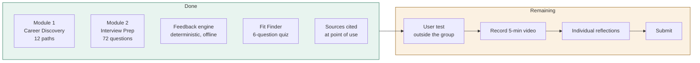

# Sprint Plan — IS Career Launchpad

**Deliverables due: Friday 4 September, 8:00 AM.**
At the time this plan was written that was roughly **36 hours away**. This is a
sprint plan, not a semester plan. Everything below is ordered so that if you run
out of time, the things you drop are the things that cost you the fewest points.

---

## 1. What the case actually grades

Read the rubric backwards before doing anything else. The weighting tells you
where to spend the remaining hours.

| Component | Weight | Status |
|---|---|---|
| Career Discovery Module (functionality + depth) | 30% | **Built** — 12 paths, exceeds the 4 required |
| Interview Prep Module (functionality + feedback quality) | 30% | **Built** — 12 paths × 6 questions, deterministic feedback engine |
| Video Presentation & Communication | 20% | **Not started** — needs all of you |
| Individual Reflection & Personal Accountability | 20% | **Not started** — each person writes their own |

Two things follow from this table:

1. **40% of the grade has not been started, and it is the 40% that AI cannot do
   for you.** The prototype is the part that was fastest to build. The video and
   reflections are now the highest-value hours remaining.
2. The prototype is already past the "Excellent" bar on coverage (12 paths, not
   4). Further building has sharply diminishing returns. Resist it.

---

## 2. Where the build currently stands

The prototype requirement — *"the output should be an HTML file that can be run
on any browser"* — is satisfied by `index.html`. One file, no server, no
database, no network calls. It runs from a `file://` URL, which also means the
demo cannot fail because of campus wifi.

---

## 3. The schedule

### Block A — tonight (2–3 hours, everyone)

| Who | Task | Done when |
|---|---|---|
| Everyone | Open `index.html`, click every path, run one interview question each | You can each explain what happens when you press "Get feedback" |
| One person | Read `docs/ARCHITECTURE.md` end to end | You can answer "how does the scoring work" without hedging |
| Everyone | Claim your section of the video (see §4) | Names written next to sections below |

**This block is not optional.** The case says explicitly: *"If an evaluator asks
how something works and you cannot answer, that is a problem."* Every person
must be able to explain the component they demo.

### Block B — tomorrow morning (2 hours)

| Who | Task | Why |
|---|---|---|
| 1 person | Test the tool on someone outside the group | §6 of the case asks this directly. Costs 20 minutes, gives you a real answer to a guiding question |
| 1 person | Fact-check 5 salary figures against the linked sources | If a number is stale, fix it or say so on camera |
| 2 people | Draft the video script from `docs/DEMO-SCRIPT.md` | Rehearse once before recording |

### Block C — tomorrow afternoon (3 hours)

1. **Record the video.** Five minutes maximum. One take is fine — polish is not
   graded, clarity is. Rubric wants *"all members communicate clearly"*, so
   everyone speaks.
2. **Everyone writes their own reflection.** Do not write these together, and do
   not write them in one sitting at 2am. They are 20% of the grade.
3. **Submit by 8:00 AM.** Build in buffer — submit Thursday night if you can.

### Block D — only if Blocks A–C are finished early

Ranked by marginal points per hour. Do them in order, stop when time runs out.

1. Add a second user test and mention both on camera.
2. Add a "compare two paths side by side" view.
3. Add localStorage so answers survive a refresh.
4. Anything else you are tempted by — the answer is no, record the video instead.

---

## 4. Division of labour

The case grades individual accountability, and the peer evaluation asks
specifically about carrying a fair share, keeping the team on track, and
bringing relevant skills. Assign names now and write them here.

| Role | Name | Owns | Speaks in the video about |
|---|---|---|---|
| Data owner | | `src/data/careers.js`, source accuracy | Where the numbers come from, and the BLS-vs-industry distinction |
| Question owner | | `src/data/questions.js`, question sourcing | Why these questions are real, not invented |
| Engine owner | | `src/js/feedback.js` | How feedback is generated without an AI call |
| UI owner | | `src/js/app.js`, `src/css/` | The walkthrough demo itself |

Each person owns different files on purpose — four people can edit in parallel
without merge conflicts, and each person has something specific to speak to.

---

## 5. The guiding questions, answered

Section 6 of the case lists questions strong teams should be able to answer.
Here are the answers this build already supports. **Read these — they are your
video content and your reflection material.**

> **How are you deciding which IS career paths to include?**

Twelve paths, chosen to span the range rather than to cover the obvious four.
They map onto the career tracks BYU IS Careers itself publishes (BI/Analytics,
Cybersecurity, Product/Project Management, Consulting, Information Technology),
plus the tracks the case suggested. Every path carries its sources inline.

> **How is your tool different from just Googling "IS career paths"?**

Three ways, and this is the strongest thing you can say on camera:

1. **It shows the gap Google hides.** Search "software developer salary" and you
   get $135,040 — a BLS median pooling twenty-year veterans with new hires. Our
   chart puts that bar next to BYU's *actual reported starting average* of
   $72,487 and names the difference. A student who only Googles walks into a
   negotiation with the wrong number.
2. **It labels source quality.** Bars marked *industry est.* come from salary
   guides rather than government survey data, because those roles have no single
   BLS occupation code. Google presents both with equal confidence. We do not.
3. **It is a practice tool, not a reading tool.** You cannot Google your way to
   having attempted a mock interview.

> **How did you research what questions are actually asked?**

Every question is candidate-reported (Glassdoor) or published in a hiring guide
(Indeed, Tech Interview Handbook, Salesforce Ben, InterviewPrep, Infosec). None
were invented. The source is printed under each question in the UI.

> **What makes good interview feedback?**

Our working definition, which drove the engine design: feedback is good when it
is **specific** (names the missing thing, not "add detail"), **actionable** (the
user knows what sentence to write next), and **honest about its own limits** (the
engine says plainly that it cannot judge whether your facts are true). The "Fix
this first" box exists because a list of six critiques causes paralysis; one
prioritised fix causes a rewrite.

> **What was the hardest technical problem?**

Making feedback useful without an AI API. See `docs/ARCHITECTURE.md` §4 — the
short version is that we classify each question into story / approach /
technical and score against a different rubric for each, because applying STAR
to "How do you stay organised?" produces confidently wrong feedback.

> **Were there moments when AI gave bad or misleading output? How did you catch it?**

Yes — three worth telling, all documented in `docs/ARCHITECTURE.md` §5:
a scoring bug where an answer covering **6 of 6** required concepts scored 39%;
feedback that contradicted itself ("you named every point" next to "an
interviewer will read this as *does not know it*"); and STAR detection that
failed on our own gold-standard answers. We caught them by writing a regression
test that scores all 72 model answers and flags any below 80% — not by reading
the code and assuming it was right.

---

## 6. Definition of done

- [ ] `index.html` opens in Chrome, Safari and Edge with no console errors
- [ ] Every team member has clicked through both modules themselves
- [ ] One person outside the group has used it, and you wrote down what confused them
- [ ] Five salary figures spot-checked against their linked sources
- [ ] Video recorded, under 5:00, every member speaking
- [ ] Four individual reflections written separately
- [ ] Peer evaluations completed
- [ ] Submitted with time to spare

---

## 7. Risks

| Risk | Likelihood | Mitigation |
|---|---|---|
| Demo fails during recording | Low | No network calls — works offline from a local file. Test on the recording machine first. |
| Evaluator asks how the engine works and nobody can answer | **Medium** | Block A exists to prevent exactly this. It is the single most likely way to lose points on work you already did. |
| A salary figure is stale | Medium | Every figure links to its source; spot-check five. Saying "we verified this on 3 September" on camera is a strength, not a hedge. |
| Video runs over 5 minutes | **High** | Rehearse with a timer. Cut the intro, not the demo. |
| Reflections written at 2am | High | Block C. They are 20% — the same weight as the video. |
